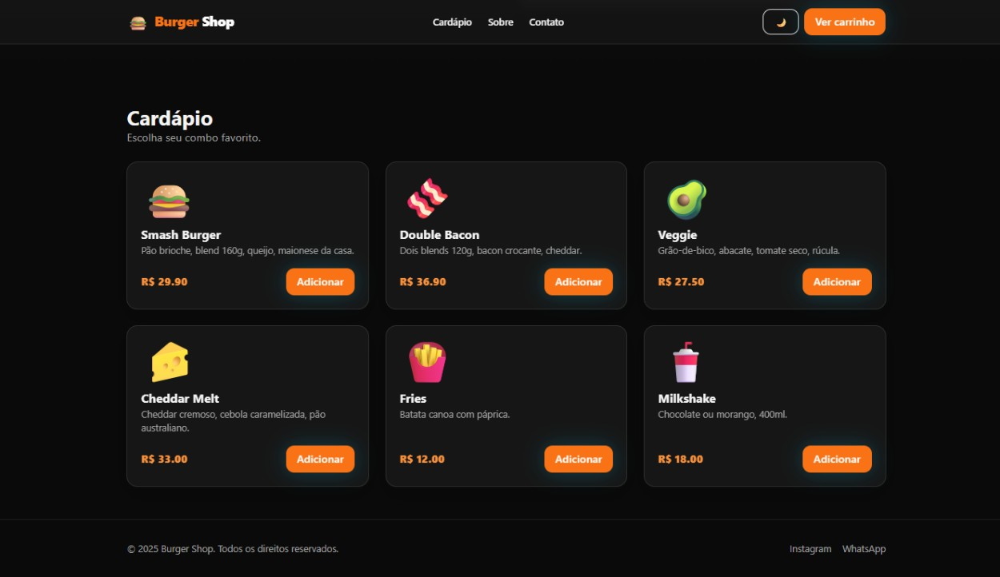

<p align="center">
  
</p>

<h1 align="center">🍔 Burger Shop UI</h1>

<p align="center">
  Interface moderna para hamburgueria, feita com <strong>React + Vite + TailwindCSS</strong>.<br/>
  Inclui landing page, cardápio dinâmico, carrinho lateral com totalizador e <strong>dark mode</strong>.
</p>

<p align="center">
  <a href="https://therunnas.github.io/burger-shop-ui-/">
    
  </a>
  <a href="https://github.com/therunnas/burger-shop-ui-/issues">
    
  </a>
  <a href="LICENSE">
    
  </a>
</p>

<p align="center">
  <a href="https://therunnas.github.io/burger-shop-ui-/"><strong>🌐 Acessar Demo</strong></a> ·
  <a href="#-recursos">Recursos</a> ·
  <a href="#-instalação">Instalação</a> ·
  <a href="#-estrutura-do-projeto">Estrutura</a> ·
  <a href="#-próximos-passos">Próximos Passos</a>
</p>

---

## ✨ Recursos

- **UI limpa e responsiva** — adaptada para dispositivos móveis e desktop  
- **Dark Mode** com toggle e persistência  
- **Cardápio dinâmico** (mock)  
- **Carrinho lateral (drawer)** com somatório e ajuste de quantidade  
- **Design System** simples via Tailwind (cores brand + sombras + glass)  
- **Build rápido** com Vite e deploy automático no GitHub Pages  

---

## 🖼 Preview

<p align="center">
  
</p>

---

## 🚀 Instalação

```bash
# Clonar repositório
git clone https://github.com/therunnas/burger-shop-ui-.git
cd burger-shop-ui-

# Instalar dependências
npm install

# Rodar em modo desenvolvimento
npm run dev

# Build de produção
npm run build
npm run preview

## 📜 Licença

Este projeto está sob licença MIT — veja o arquivo [LICENSE](LICENSE) para mais detalhes.
